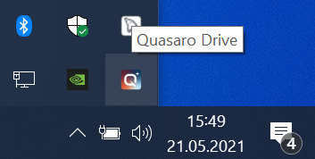
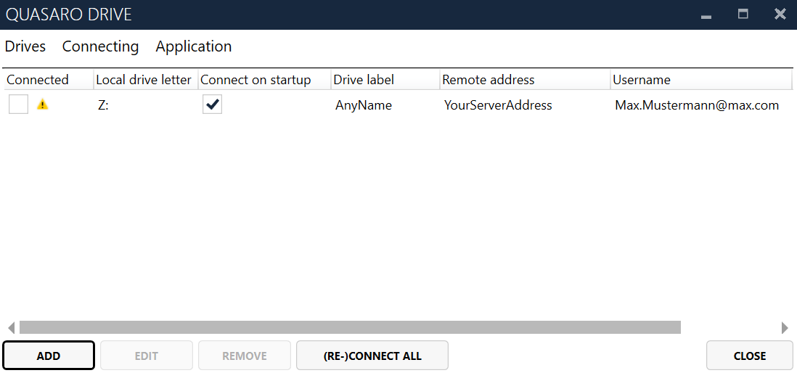
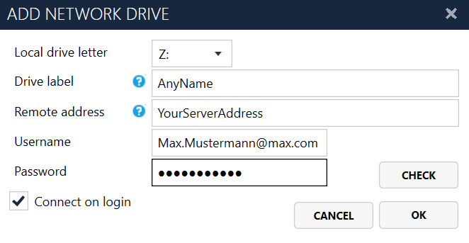
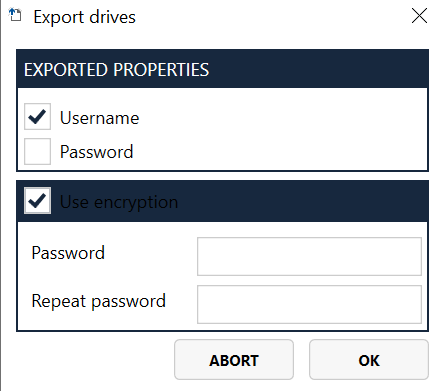
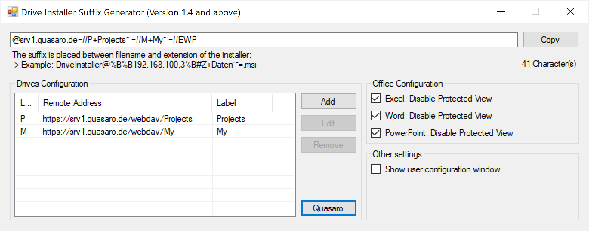

   

[](https://quasaro.de)

# Quasaro Drive

With Quasaro Drive you can easily manage multiple network drives and only establish a connection when necessary and therefore increase your mobility. Stability is ensured by continuous connectivity checks and automatic reconnection. It utilizes state of the art encryption schemes to protect your credentials in persistent storage. Quasaro Drive can be easily distributed using most modern software distribution mechanisms and automatically configured by a custom configuration template at the first start per user.

## Installation

Execute the installer to install the application. Automatic configuration mechanisms for software distribution are described in detail later in this document.

## Requrements
Supported Windows versions:
-	Windows Server 2008 R2 with Service Pack 1
-	Windows XP with Service Pack 2
-	Windows 7 or newer

Dependencies:
-	.NET Framework 3.5

## Quick Start Guide

This chapter will describe how to setup Quasaro Drive on your local computer. 



Once Quasaro Drive is activated you can access the application using the notify icon on your taskbar beside the system clock. If you cannot see the symbol, try clicking on the upward arrow on the left. You can either double click the symbol to show/hide the main window or right click it to open a context menu showing other options. Exit will close the application and stop all background activities.



The main window shows a list of all configured network drives. You can connect and disconnect these drives by toggling the checkbox in the first column on the left side of an entry. If errors occurred while connecting to the drive, a warning symbol will be displayed. Move the mouse over this symbol to view the error message. The other columns display the information as entered in the add or edit dialog.



**Add new drives** by clicking the button Add. This will open a dialog where you can enter the drive properties. Select the **drive letter** first. Used letters will not be available in the dropdown list. Enter a **drive label** which will be the visible name as shown in the Windows Explorer. The remote address can be in one of the following formats depending on your connection type:

| Type                | Example Path               |
|---------------------|----------------------------|
| SMB (Windows Share) | \\192.168.100.3\Data       |
| WebDAV              | https://example.org/webdav |
|                     |                            |

You can use environment variables like %USERNAME% in the fields drive label and remote address. This allows for a more personalized configuration even when using automatic software distribution.
Now enter your credentials in the fields below. For a quick connectivity check you can press the button Check. This will disconnect an existing connection to this drive when you are editing a drive.

Check the option **Connect on login* if you want the drive to be automatically connected after your windows login. Click OK to finish and add the drive to the list. To connect the drive, please activate the checkbox on the left in the main window.

To **edit the drive**, you can either double click a list entry, or select an entry and click Edit on the main window. **Removing drives** works in the same way. You can even remove multiple drives at once by holding the control key and selecting list entries. The selected drives can be connected or disconnected in the Connecting menu on the upper menu of the main window. Alternatively, you can perform these actions on all drives regardless from the current list selection. The behavior of the option (Re)Connect all can be customized in the options dialog (more details in the options chapter).

## Migrate Configuration

Due to the encryption scheme used to store user credentials, you cannot just copy the configuration files to another machine or user directory. To migrate your configuration, use the import and export functionality in the Drives menu on the main window.



The first step is to **export** your configuration. You can either export only selected drives or your complete list.  The export always includes drive letter, drive label, remote address and the connect at startup option. You can optionally export your credentials (username and/or password). When exporting with credentials it is recommended to enter a password for encryption.

On **importing** the configuration, you need to enter the encryption password. All drives will be added to your list without further checking. Only existing remote addresses are skipped to ignore double entries. If a drive letter is already in use, another drive letter will be used instead.

## Settings

Click Check for updates to search for a newer application version on the internet. A new installer will automatically be downloaded and executed.

Show settings window by clicking on Options. You can configure multiple settings here:

| Setting Name                               | Effect                                                                                                                                                                                                                                                                                                                                                                            |
|--------------------------------------------|-----------------------------------------------------------------------------------------------------------------------------------------------------------------------------------------------------------------------------------------------------------------------------------------------------------------------------------------------------------------------------------|
| Start Quasaro Drive after user login       | Automatically start the background activity of Quasaro Drive after your windows login. This option is required for automatic drive connections on startup.                                                                                                                                                                                                                        |
| Check for updates at startup               | This option will search for new application versions at every start.                                                                                                                                                                                                                                                                                                              |
| Allow Beta versions                        | Allows to install versions with the newest features which might not be stable yet.                                                                                                                                                                                                                                                                                                |
| Only reconnect at startup connected drives | Affects the “Reconnect all drives” behavior. Only drives which are selected for automatic connection will be reconnected.                                                                                                                                                                                                                                                         |
| Language                                   | Choose your preferred language here. A restart of Quasaro Drive will be required.                                                                                                                                                                                                                                                                                                 |
| Disable Protected View                     | This option will disable protected view for the chosen Microsoft Office applications.                                                                                                                                                                                                                                                                                             |
| (Excel, Word, PowerPoint)                  |                                                                                                                                                                                                                                                                                                                                                                                   |
|                                            | WARNING: The protected view mode increases your security by blocking all scripts from remote sources. By disabling the protected view, Microsoft Office will execute all attached scripts. This option also affects drives which are not managed by Quasaro Drive. Only use this option if you understand this risk. Do not open files for Microsoft Office from unknown sources. |

Click on Advanced to show more specific options. These settings affect the application on a technical level and might lead to undesired side effects. Consider restoring the default values on problems.

| Setting Name                                         | Effect                                                                                                                                                                                                                                                                 |
|------------------------------------------------------|------------------------------------------------------------------------------------------------------------------------------------------------------------------------------------------------------------------------------------------------------------------------|
| Show “Restart WebClient service” button in main menu | Another option in the context menu Connecting on the main window will be available to restart the WebClient service. This will disconnect all active network connections on your system but might help to solve problems caused by invalid or conflicting credentials. |
|                                                      | Default: No                                                                                                                                                                                                                                                            |
| Show button to open log file                         | Shows another option in the system tray context menu to quickly show the latest log file.                                                                                                                                                                              |
|                                                      | Default: Yes                                                                                                                                                                                                                                                           |
| Preload main window                                  | Activate this option if it takes a long time to show the main window for the first time. Might cause the main window to be visible for a short time after login.                                                                                                       |
|                                                      | Default: No                                                                                                                                                                                                                                                            |
| Use fast WebDAV checking for connectivity            | Bypass the Windows network drive mechanism for checking. Can lead to inconsistent results in rare cases.                                                                                                                                                               |
|                                                      | Default: Yes                                                                                                                                                                                                                                                           |
| Use Windows API calls instead of CLI                 | Disable this option to use Windows console commands in the application backend to control network drives.                                                                                                                                                              |
|                                                      | Default: Yes                                                                                                                                                                                                                                                           |

## Drive Installer Suffix Generator

To make software distribution in an enterprise environment feasible, an automatic **configuration distribution** mechanism is required. This can be done by adding a **suffix** to the installer filename which can be generated by a generator application.



Configure the network drives with default drive letter, remote address and drive label in the list on the left. Use environment variables like %USERNAME% to adapt the configuration to the environment. You can also configure the Microsoft Office protected view behavior. **Keep in mind:** This setting affects all network drives on the systems after software distribution and might introduce new vulnerabilities.

Check Show user configuration window to always show an initial configuration window where you can select drives to add to your local network drive list. You can also configure drive letter and label here. This window will also be shown if there are drive letter conflicts between your system and the distributed configuration.

After accepting the configuration, the user will be prompted to enter the credentials. These will be automatically saved for the network drive and stored permanently for later use.

To activate the initial configuration, just copy the text from the uppermost field and add it to your installers filename (but keep the extension .msi). Example:

```
Original installer filename: DriveInstall.msi
Suffix taken from generator: @%B%B192.168.100.3%B#Z+Daten~=
With suffix: DriveInstall@%B%B192.168.100.3%B#Z+Daten~=.msi
```

**Keep in mind**: Most filesystem do not accept more than 256 characters in a path including filename and location. The generator application will show you the length of the configuration suffix which will add up to the filename and path. If you run into errors, try reducing the filename itself as you do not need to keep the old filename. Only the file extension “.msi” is required. If you have control over the installers storage location, you can place the installer on a lower location in the directory hierarchy.

## Troubleshooting
**Network Drive connection fails with message “The network name cannot be found.”**
This happens when connecting to WebDAV resources if the proper WebDAV client is not installed in the system. Please install the feature **“User Interfaces and Infrastructure” → “Desktop Experience” (“Benutzeroberflächen und Infrastruktur” → “Desktopdarstellung”)** to fix this issue.

**Connection errors during connectivity checking even for correct credentials**
Erroneous HTTPS configurations on the server side can cause this error. Consider switching to TLS encryption. A client-side workaround is by disabling the fast WebDAV connectivity check in the advanced configuration (see details for advanced settings above).

**Conflicting or wrong credentials message for correct credentials**
This error is mostly caused by the Microsoft Windows credentials cache. Updating the cache will result in a conflicting credentials message. Waiting one or two minutes often solves this error. Alternatively, you can restart the WebClient service (see advanced settings) to handle this problem.


## Contributing
Pull requests are welcome. For major changes, please open an issue first to discuss what you would like to change.

## Project Information
Official website: https://quasaro.de
Code repository: https://github.com/StieCon/quasaro-drive

## License
[GNU GPLv3](https://choosealicense.com/licenses/gpl-3.0/)
